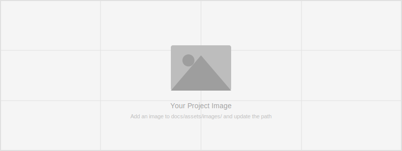

<!--
CHECKLIST FOR THIS PAGE:
- [ ] Replace the two placeholder cards (marked [YOUR PROJECT ...]) with your real projects
- [ ] For each project: add a thumbnail image to docs/assets/images/ and update the path below
- [ ] For each project: create a project page by copying sample-project.md
- [ ] For each project: add a nav entry in mkdocs.yml (see the comments there)
- [ ] Delete placeholder cards you don't need yet
-->

# Projects

A selection of my geospatial projects. Click any card to see the full write-up.

**[Land Cover Classification of Bangalore](sample-project.md)**

Mapping urban land cover using Landsat-8 imagery and a Random Forest classifier.
Achieved 89% overall accuracy across 6 land cover classes.

`Python` `scikit-learn` `Google Earth Engine` `QGIS`

[View Project →](sample-project.md){ .md-button .md-button--primary }

**[Route Optimization for Service Centers](route_optimization.ipynb)**

Optimizing visit order for Bangalore government service centers using the OpenRouteService
API. Geocodes addresses, solves the vehicle routing problem, and visualizes the optimal
route on an interactive map.

`Python` `Folium` `OpenRouteService` `Geopy`

[View Project →](route_optimization.ipynb){ .md-button .md-button--primary }

**[YOUR PROJECT 3 TITLE]**

[YOUR PROJECT 3 DESCRIPTION — one or two sentences: what you did, what data you used,
and what you found or built.]

`[TOOL 1]` `[TOOL 2]` `[TOOL 3]`

[View Project →](){ .md-button }

