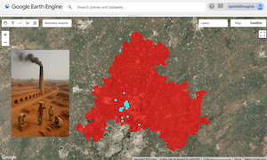
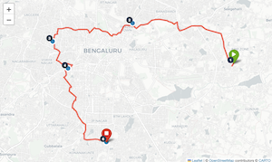

<!--
CHECKLIST FOR THIS PAGE:
- [ ] Replace the two placeholder cards (marked [YOUR PROJECT ...]) with your real projects
- [ ] For each project: add a thumbnail image to docs/assets/images/ and update the path below
- [ ] For each project: create a project page by copying sample-project.md
- [ ] For each project: add a nav entry in mkdocs.yml (see the comments there)
- [ ] Delete placeholder cards you don't need yet
-->

# Projects

A selection of my geospatial projects. Click any card to see the full write-up.

**[Mapping Brick Kilns using Satellite Embeddings](brick-kiln.md)**

Used Google's AlphaEarth Satellite Embeddings dataset to map brick kiln locations in Gandhinagar district, Gujarat, India.

`Embeddings` `Machine Learning` `Google Earth Engine`

[View Project →](brick-kiln.md){ .md-button .md-button--primary }

**[Route Optimization for Service Centers](route_optimization.ipynb)**

Optimizing visit order for Bangalore government service centers using the OpenRouteService
Optimization API and visualizes the optimal route on an interactive map.

`Python` `Folium` `OpenRouteService` `Geopy`

[View Project →](route_optimization.ipynb){ .md-button .md-button--primary }

**[YOUR PROJECT TITLE](sample-project.md)**

[YOUR PROJECT DESCRIPTION — one or two sentences: what you did, what data you used,
and what you found or built.]

`[TOOL 1]` `[TOOL 2]` `[TOOL 3]`

[View Project →](sample-project.md){ .md-button }

