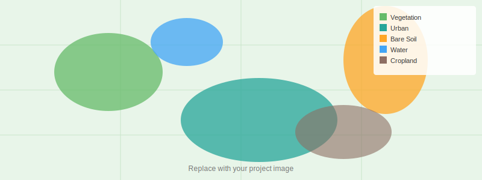

<!--
CHECKLIST FOR THIS PAGE (copy this file for each new project):
- [ ] Replace [YOUR PROJECT TITLE] with your project title
- [ ] Replace the hero image with your own (add to docs/assets/images/)
- [ ] Update the Overview section
- [ ] Update the Methods & Tools section
- [ ] Update the Key Findings section
- [ ] Update the Links section
- [ ] Add a card for this project on docs/projects/index.md
- [ ] Add a nav entry in mkdocs.yml
-->

# Land Cover Classification of Bangalore

## Overview

This project maps urban land cover in the Bangalore metropolitan region using multispectral
Landsat-8 imagery and a Random Forest classifier trained in Python. Six land cover classes
were mapped: urban/built-up, vegetation, water bodies, bare soil, cropland, and peri-urban.
The classification achieved an overall accuracy of 89% validated against ground truth points
collected in the field.

**Duration:** June – August 2024  
**Role:** Solo project  
**Status:** Completed

---

## Methods & Tools

**Data Sources**

- Landsat-8 OLI imagery (30 m resolution) from USGS Earth Explorer
- Ground truth points collected via field survey (n = 250)
- OpenStreetMap for reference basemap

**Processing Steps**

1. Cloud masking and atmospheric correction using LEDAPS in Google Earth Engine
2. Computation of spectral indices: NDVI, NDWI, NDBI
3. Random Forest classifier trained with 70% of ground truth points
4. Accuracy assessment using held-out 30% (confusion matrix, kappa coefficient)
5. Final map export and visualization in QGIS

**Tools Used**

| Tool | Purpose |
|------|---------|
| Google Earth Engine | Image acquisition and pre-processing |
| Python + scikit-learn | Random Forest classifier |
| QGIS | Visualization and cartography |
| Matplotlib | Charts and accuracy plots |
| Pandas | Tabular data management |

---

## Key Findings

- Overall accuracy: **89.3%** (Kappa: 0.87)
- Urban/built-up area has expanded by **23%** compared to 2014
- Vegetation cover declined by **18%** in the same period, concentrated in the northern corridor
- Water bodies showed high classification accuracy (F1 = 0.94) due to strong NDWI signal

---

## Links

[View Code on GitHub](https://github.com/[YOUR-GITHUB-USERNAME]/[YOUR-REPO-NAME]){ .md-button }
[Data Source (USGS)](https://earthexplorer.usgs.gov){ .md-button }
